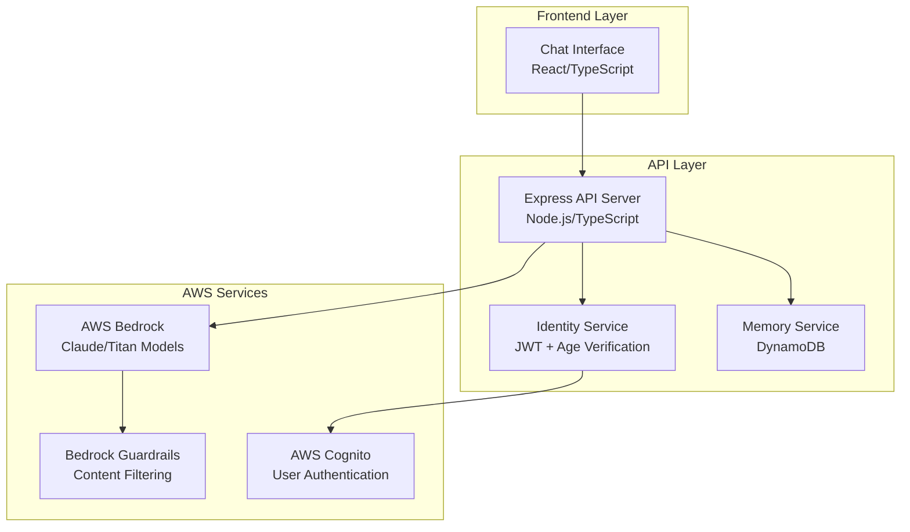
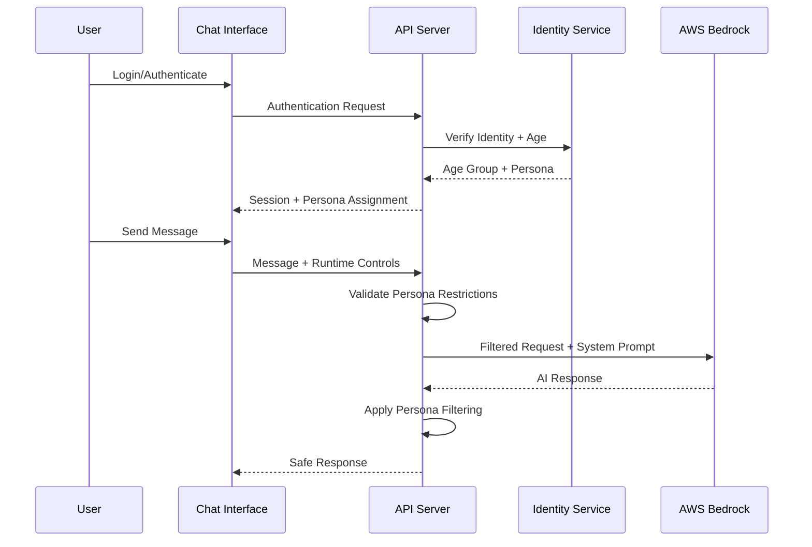

# Design Document: Nuri Family AI System

## Overview

Nuri is a family-safe AI companion system built on AWS Bedrock that provides ChatGPT-like conversational capabilities with strict age-based safety controls. The system implements immutable persona assignment based on verified identity, runtime conversation controls, and comprehensive content filtering to ensure age-appropriate interactions that cannot be bypassed through prompt manipulation.

The architecture follows a three-tier design with clear separation of concerns: a React-based chat interface, a Node.js/Express API layer, and AWS Bedrock integration with custom guardrails. The system prioritizes safety through multiple layers of protection including identity verification, persona-based restrictions, AWS Bedrock Guardrails, and application-level content filtering.

## Architecture

### High-Level Architecture



### Persona Assignment Flow



## Components and Interfaces

### 1. Chat Interface (Frontend)

**Technology**: React with TypeScript, Material-UI components
**Responsibilities**:
- Provide ChatGPT-like conversational interface
- Display current persona and runtime controls
- Allow modification of Mode, Tone, and Depth settings
- Prevent persona modification attempts
- Show memory storage feedback messages

**Key Components**:
```typescript
interface ChatInterfaceProps {
  persona: PersonaType;
  runtimeControls: RuntimeControls;
  onControlsChange: (controls: RuntimeControls) => void;
}

interface RuntimeControls {
  mode: 'Explain' | 'Do' | 'Write' | 'Teach' | 'Talk';
  tone: 'Friendly' | 'Professional' | 'Calm' | 'Encouraging' | 'Direct';
  depth: 'Short' | 'Medium' | 'Deep';
}
```

### 2. API Server (Backend)

**Technology**: Node.js with Express and TypeScript
**Responsibilities**:
- Handle authentication and session management
- Enforce persona-based restrictions
- Manage conversation flow and memory storage
- Interface with AWS Bedrock and Guardrails
- Apply application-level content filtering

**Key Endpoints**:
```typescript
POST /api/auth/login
POST /api/chat/message
GET /api/chat/history
PUT /api/controls/runtime
GET /api/user/persona
```

### 3. Identity Service

**Technology**: AWS Cognito integration with custom age verification
**Responsibilities**:
- Authenticate users with verified identity data
- Determine age groups from identity information
- Assign immutable personas for session duration
- Prevent persona override attempts

**Persona Mapping**:
```typescript
enum PersonaType {
  CHILD_U12 = 'child_u12',
  TEEN_13_17 = 'teen_13_17',
  TEEN_ADULT_18_25 = 'teen_adult_18_25',
  ADULT_25_PLUS = 'adult_25_plus',
  GUEST = 'guest'
}

interface PersonaConfig {
  contentRestrictions: string[];
  memoryAllowlist: string[];
  refusalMessage: string;
  languageStyle: string;
}
```

### 4. Memory Service

**Technology**: AWS DynamoDB with TTL for session management
**Responsibilities**:
- Store conversation history within session boundaries
- Manage user preferences based on persona restrictions
- Enforce memory storage consent requirements
- Provide memory blocking feedback messages

**Storage Rules by Persona**:
- **child_u12/teen_13_17**: Learning preferences, study goals only
- **teen_adult_18_25**: Preferences, learning goals only  
- **adult_25_plus**: Preferences, goals, household rules only
- **guest**: No storage allowed

### 5. Bedrock Integration Service

**Technology**: AWS Bedrock SDK with Claude/Titan models
**Responsibilities**:
- Generate AI responses using AWS Bedrock models
- Apply system prompts with immutable persona context
- Honor runtime controls (Mode, Tone, Depth)
- Interface with Bedrock Guardrails for content filtering

**System Prompt Structure**:
```typescript
interface SystemPrompt {
  persona: PersonaType;
  runtimeControls: RuntimeControls;
  safetyInstructions: string;
  refusalGuidelines: string;
}
```

## Data Models

### User Session Model
```typescript
interface UserSession {
  sessionId: string;
  userId: string;
  persona: PersonaType;
  ageGroup: string;
  runtimeControls: RuntimeControls;
  createdAt: Date;
  expiresAt: Date;
}
```

### Conversation Model
```typescript
interface Conversation {
  sessionId: string;
  messages: Message[];
  memoryConsent: boolean;
  allowedMemoryTypes: string[];
}

interface Message {
  id: string;
  role: 'user' | 'assistant';
  content: string;
  timestamp: Date;
  persona: PersonaType;
  runtimeControls: RuntimeControls;
}
```

### Memory Storage Model
```typescript
interface UserMemory {
  userId: string;
  persona: PersonaType;
  preferences: Record<string, any>;
  learningGoals: string[];
  householdRules?: string[]; // adult_25_plus only
  consentGiven: boolean;
  lastUpdated: Date;
}
```

## Correctness Properties

*A property is a characteristic or behavior that should hold true across all valid executions of a system-essentially, a formal statement about what the system should do. Properties serve as the bridge between human-readable specifications and machine-verifiable correctness guarantees.*
